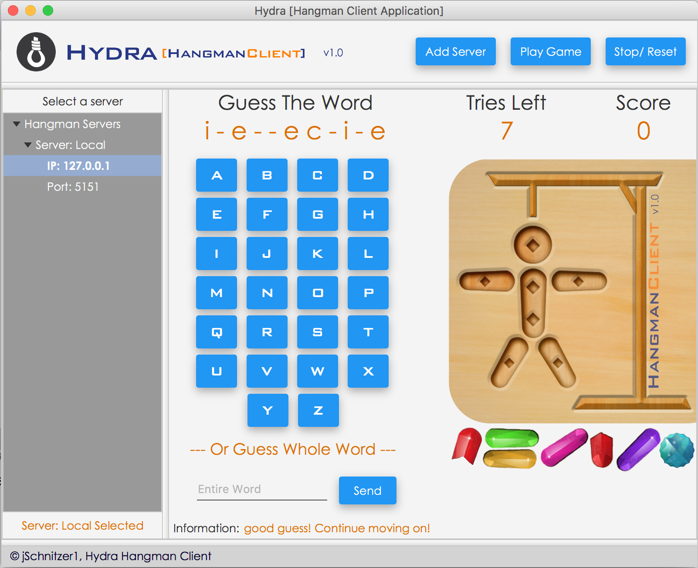

## KTH - ADVANCED NETWORK PROGRAMMING WITH JAVA [ID2212]
Hydra is a responsive multi-threaded JavaFX hangman game that allows multiple players to connect to a server & play

#### Hydra Youtube Video: 

[Click on the screenshot image]

#### Note:
Android app for Hydra hangman on: https://github.com/jSchnitzer1/HydraAndroidClient

